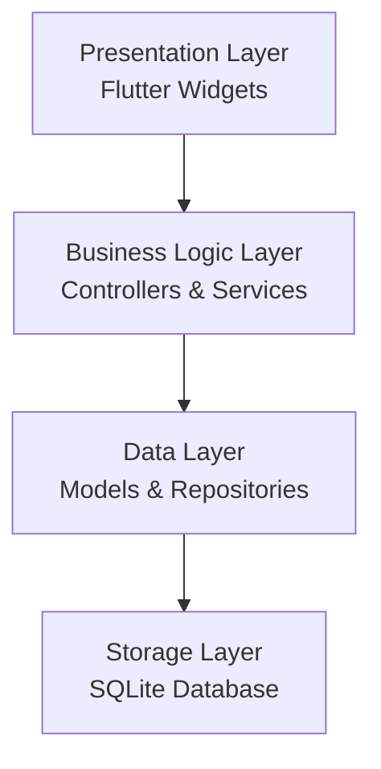

# Design Document

## Overview

The flashcards app will be built using Flutter and Dart, targeting Android mobile devices. The architecture follows a clean, layered approach with clear separation of concerns between UI, business logic, and data persistence. The app will use local storage for offline functionality and provide a modern, intuitive user interface.

## Architecture

The application follows a Model-View-Controller (MVC) pattern with the following layers:

- **Presentation Layer**: Flutter widgets and screens
- **Business Logic Layer**: Controllers and services for managing app state
- **Data Layer**: Models and repositories for data persistence
- **Storage Layer**: SQLite database for local data storage



## Components and Interfaces

### Core Components

#### 1. Models
- **Flashcard Model**: Represents a single flashcard with question, answer, category, and metadata
- **Category Model**: Represents a category with name and associated flashcards count

#### 2. Screens/Views
- **HomeScreen**: Main dashboard showing categories and navigation
- **FlashcardListScreen**: Displays all flashcards in a category
- **FlashcardReviewScreen**: Single flashcard view with flip functionality
- **AddEditFlashcardScreen**: Form for creating/editing flashcards
- **CategoryManagementScreen**: Interface for managing categories

#### 3. Controllers
- **FlashcardController**: Manages flashcard CRUD operations
- **CategoryController**: Handles category management
- **ReviewController**: Controls review session state and navigation

#### 4. Services
- **DatabaseService**: Handles SQLite database operations
- **StorageService**: Manages local data persistence

### Key Interfaces

```dart
// Flashcard Repository Interface
abstract class FlashcardRepository {
  Future<List<Flashcard>> getAllFlashcards();
  Future<List<Flashcard>> getFlashcardsByCategory(String categoryId);
  Future<void> insertFlashcard(Flashcard flashcard);
  Future<void> updateFlashcard(Flashcard flashcard);
  Future<void> deleteFlashcard(String id);
}

// Category Repository Interface
abstract class CategoryRepository {
  Future<List<Category>> getAllCategories();
  Future<void> insertCategory(Category category);
  Future<void> updateCategory(Category category);
  Future<void> deleteCategory(String id);
}
```

## Data Models

### Flashcard Model
```dart
class Flashcard {
  final String id;
  final String question;
  final String answer;
  final String categoryId;
  final DateTime createdAt;
  final DateTime updatedAt;
  
  Flashcard({
    required this.id,
    required this.question,
    required this.answer,
    required this.categoryId,
    required this.createdAt,
    required this.updatedAt,
  });
}
```

### Category Model
```dart
class Category {
  final String id;
  final String name;
  final String color; // Hex color code for UI theming
  final DateTime createdAt;
  
  Category({
    required this.id,
    required this.name,
    required this.color,
    required this.createdAt,
  });
}
```

### Database Schema

#### Flashcards Table
```sql
CREATE TABLE flashcards (
  id TEXT PRIMARY KEY,
  question TEXT NOT NULL,
  answer TEXT NOT NULL,
  category_id TEXT NOT NULL,
  created_at INTEGER NOT NULL,
  updated_at INTEGER NOT NULL,
  FOREIGN KEY (category_id) REFERENCES categories (id)
);
```

#### Categories Table
```sql
CREATE TABLE categories (
  id TEXT PRIMARY KEY,
  name TEXT NOT NULL UNIQUE,
  color TEXT NOT NULL,
  created_at INTEGER NOT NULL
);
```

## Error Handling

### Error Types
1. **Database Errors**: Connection failures, constraint violations
2. **Validation Errors**: Empty fields, invalid input
3. **Storage Errors**: Insufficient space, permission issues

### Error Handling Strategy
- Use try-catch blocks around all database operations
- Implement custom exception classes for different error types
- Display user-friendly error messages with actionable guidance
- Implement retry mechanisms for transient failures
- Log errors for debugging while maintaining user privacy

### Error Recovery
```dart
class ErrorHandler {
  static void handleDatabaseError(DatabaseException e) {
    // Log error details
    // Show user-friendly message
    // Attempt recovery if possible
  }
  
  static void handleValidationError(ValidationException e) {
    // Display field-specific error messages
    // Guide user to correct input
  }
}
```

## Testing Strategy

### Unit Testing
- Test all model classes and their methods
- Test repository implementations with mock databases
- Test controller logic and state management
- Test validation functions and error handling

### Widget Testing
- Test individual screen widgets and their interactions
- Test form validation and user input handling
- Test navigation between screens
- Test flashcard flip animations and gestures

### Integration Testing
- Test complete user flows (create → review → edit → delete)
- Test database operations with real SQLite instance
- Test category management workflows
- Test app state persistence across app restarts

### Test Structure
```
test/
├── unit/
│   ├── models/
│   ├── repositories/
│   └── controllers/
├── widget/
│   ├── screens/
│   └── components/
└── integration/
    ├── user_flows/
    └── database/
```

## UI/UX Design Considerations

### Material Design
- Follow Material Design 3 guidelines for Android
- Use consistent color scheme and typography
- Implement proper touch targets and accessibility features

### Navigation
- Bottom navigation for main sections
- Floating Action Button for quick flashcard creation
- Swipe gestures for flashcard navigation during review

### Animations
- Smooth flip animation for flashcards (3D rotation effect)
- Slide transitions between screens
- Loading animations for database operations

### Responsive Design
- Support different screen sizes and orientations
- Adaptive layouts for tablets and phones
- Proper keyboard handling for input forms

## Performance Considerations

### Database Optimization
- Use indexed queries for category-based filtering
- Implement pagination for large flashcard collections
- Use database transactions for batch operations

### Memory Management
- Lazy loading of flashcard lists
- Proper disposal of controllers and streams
- Image optimization if flashcards support media

### Caching Strategy
- Cache frequently accessed categories
- Implement in-memory caching for active review sessions
- Use Flutter's built-in widget caching mechanisms